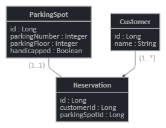

# **<p align="center">🚗 🅿️  Parking Lot API  🅿️ 🚙</p>**

[](https://circleci.com/gh/edych/Parking-Lot-API)
[](https://codecov.io/gh/edych/Parking-Lot-API)

I used H2 database for persistence and Liquibase for schema management.<br>
There is no booking restrictions per *Customer*.<br>

### Requirements
* Java 11

## Building and running the app

### Docker
```bash
docker build -t edych/parking-lot-api .
docker run -p 8080:8080 edych/parking-lot-api
```

### Maven
```bash
./mvnw clean install
java -jar target/parking-0.0.1-SNAPSHOT.jar
```
### Entity Relationship Diagram



### Prepared data
* There are two *ParkingFloors*, each with 30 *ParkingSpots*
* There is one *Customer*: `id: 1, name: edych`
* H2 Console is available at `http://localhost:8080/h2`

## API

### Swagger UI 
Documentation available at [http://localhost:8080/swagger-ui.html](http://localhost:8080/swagger-ui.html)

### AWS ECS 
Live version is running at [http://edych.codes/swagger-ui.html](http://edych.codes/swagger-ui.html) 

### Postman
There is `postman.json` collection provided in the root of repository.

### Curls
1. Create a new *Reservation*
```bash
curl -X POST 'localhost:8080/reservation' \
-H 'Content-Type: application/json' \
--data-raw '{"customerId": 1,"parkingSpotId": 5}'
```

2. Delete *Reservation*<br>
```bash
curl -X DELETE 'localhost:8080/reservation/1'
```

3. Get a list of all *Reservation*s made by *Customer*
```bash
curl -X GET 'localhost:8080/reservations?customerId=1'
```

4. Get a list of all available *ParkingSpot*s
```bash
curl -X GET 'localhost:8080/parking-spot/available'
```
